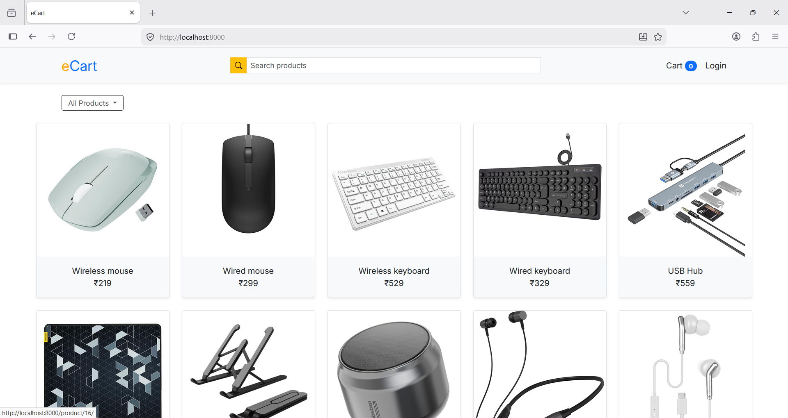
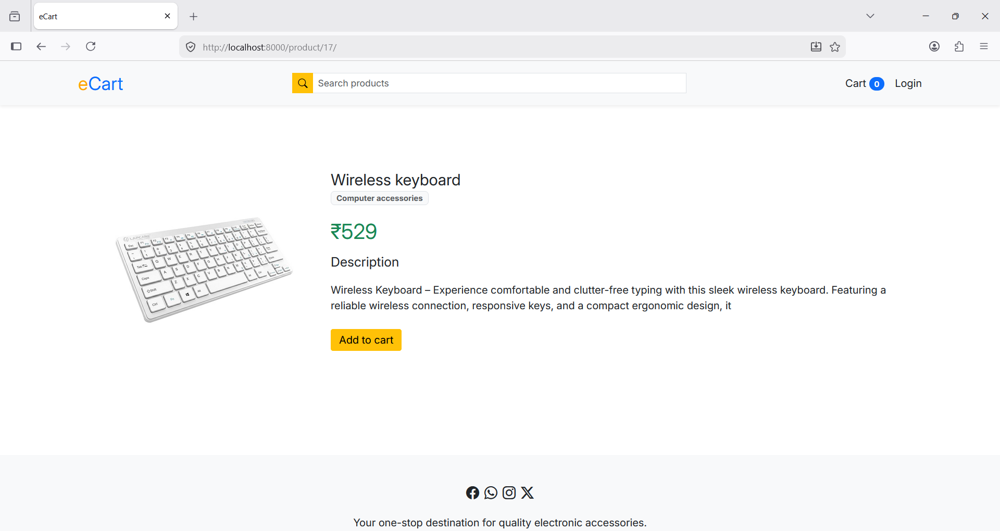
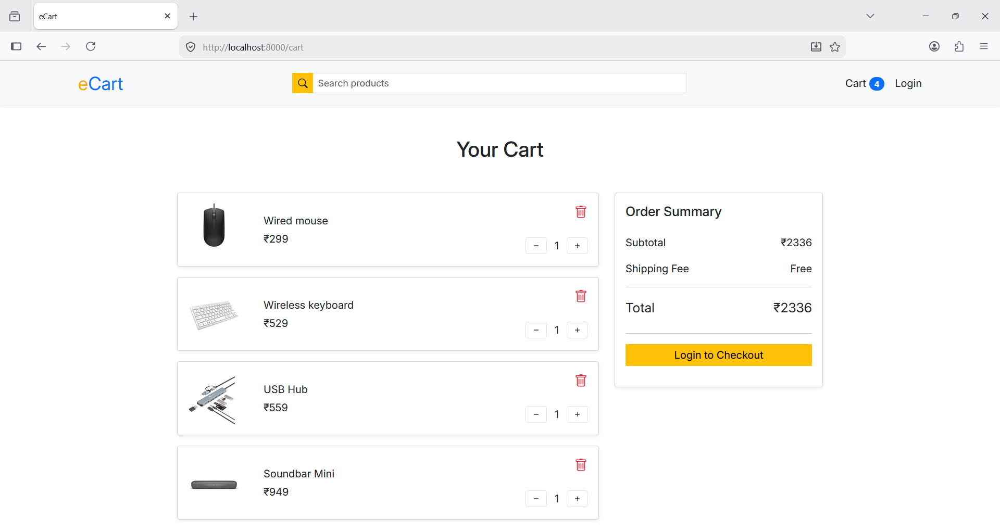
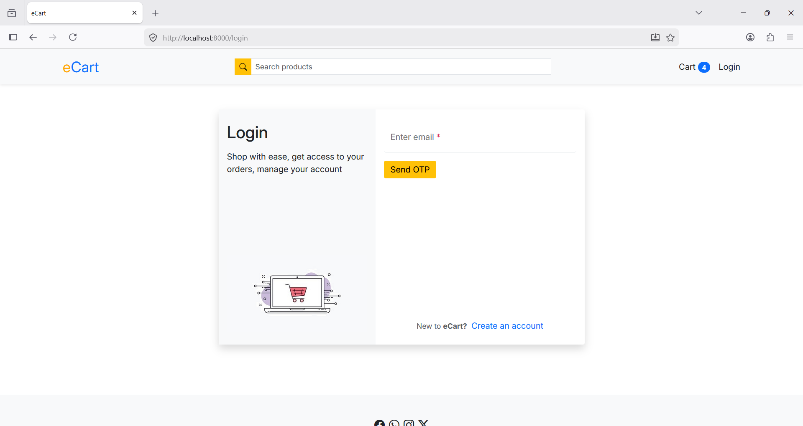
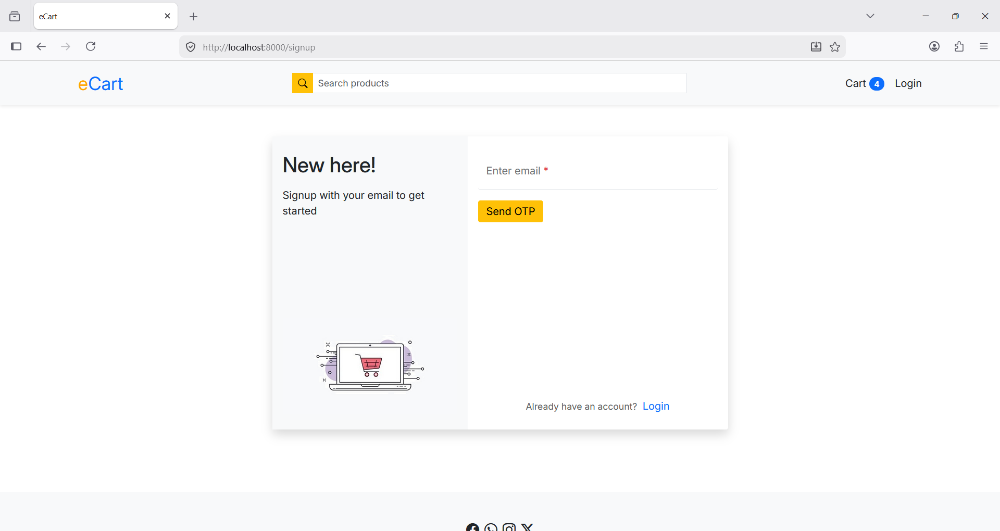
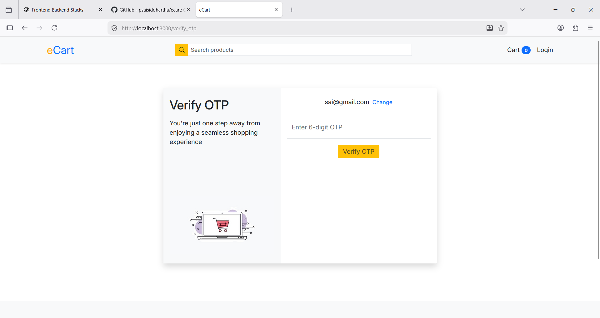
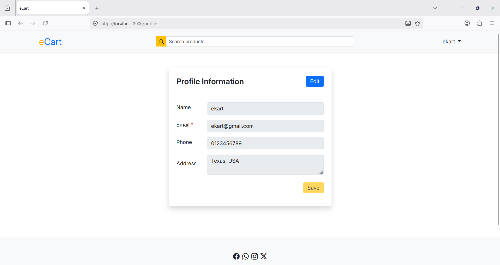
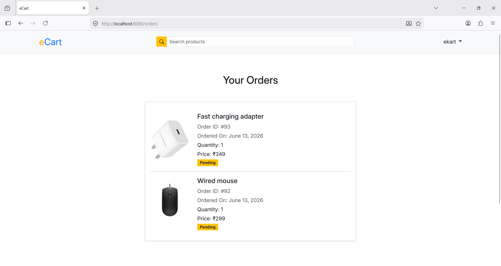

# 🛒 eCart - Django E-Commerce Application

eCart is a simple e-commerce web application built using **Django** and **Bootstrap**. The project demonstrates the fundamentals of building an online shopping platform with features such as product browsing, cart management, user authentication, profile management, and order tracking.

**Frontend:** HTML, Bootstrap v5.3, Bootstrap icons, Django Template Language (DTL)
**Backend:** Django (Python Web Framework)
**Database:** SQLite3 (default Django database)


## 📸 Application Screenshots


**Home Page**



**Product Details**



**Shopping Cart**



**Login**



**Signup**



**Verify OTP**



**Profile**



**Orders**




## 🚀 Features Implemented
|Feature|Description|
|:-----|:-----|
|User authentication|<ol><li>User Signup</li><li>Login using Email</li><li>Session-based Authentication (Verify OTP)<br></li><li>Logout</li></ol>|
|Product management|<ol><li>Display all products</li><li>Category-wise filtering</li><li>Product detail page</li><li>Product images</li><li>Product descriptions</li></ol>|
|Shopping Cart|<ol><li>Add products to cart</li><li>Remove products from cart</li><li>Quantity management</li><li>Total price calculation</li><li>Checkout</li></ol>|
|Orders|<ol><li>Place orders</li><li>View previous orders</li><li>Order status</li><li>Order history</li></ol>|
|Profile Management|<ol><li>View profile information</li><li>Edit profile information</li><li>Manage addresses (UI implemented)</li></ol>|


## 🏗️ Project Structure

```
ecart
├── Readme.md
├── db.sqlite3
├── eCart
│   ├── __init__.py
│   ├── __pycache__
│   ├── asgi.py
│   ├── settings.py
│   ├── urls.py
│   └── wsgi.py
├── manage.py
├── requirements.txt
├── store
│   ├── __init__.py
│   ├── __pycache__
│   ├── admin.py
│   ├── apps.py
│   ├── middlewares
│   ├── migrations
│   ├── models
│   ├── templates
│   ├── templatetags
│   ├── tests.py
│   ├── urls.py
│   ├── utils.py
│   └── views
├── uploads
│   ├── logo
│   └── products
└── venv
```

## ⚙️ Django Project Setup

**Step-1:** Create Virtual Environment

* `python -m venv venv`

**Step-2:** Activate

* Windows: `venv\Scripts\activate`
* Linux/macOS: `source venv/bin/activate`

**Step-3:** Install Packages

* `pip install -r requirements.txt`

**Step-4:** Apply Migrations

* `python manage.py makemigrations`
* `python manage.py migrate`


**Step-5:** Run Server

* `python manage.py runserver`

**Step-6:** Open

* `http://127.0.0.1:8000/`


## 📦 Packages Used

The project uses the following Python packages:

|Package|Purpose|
|-----|-----|
|`Django==6.6`|Main web framework used to build the e-commerce application, including models, views, templates, URL routing, authentication, sessions, and ORM.|
|`Pillow==12.2.0`|Provides image processing support required for Django ImageField and product image uploads.|

## 🧩 Modules used

|Module|Purpose|
|-----|-----|
|`django.db.models`|Provides Django's ORM (Object Relational Mapping) for defining database models and fields.|
|`django.utils.timezone`|Handles timezone-aware date and time operations. It is recommended over Python's `datetime.now()` when `USE_TZ=True`.|
|`django.contrib.messages`|Django's messaging framework used to display one-time success, error, warning, or info messages after a request.|
|`django.shortcuts.render`|Renders an HTML template with context data and returns an HTTP response.|
|`django.shortcuts.redirect`|Redirects the user to another URL or named route.|
|`store.middlewares.auth.auth_middleware`|Custom middleware created in this project to protect routes by ensuring only authenticated users can access them.|
|`django.shortcuts.get_object_or_404`|Retrieves an object from the database or automatically returns a 404 error if it doesn't exist.|

## 🗄️ Models

|Model|Description|Fields|
|:-----|:-----|:-----|
|Customer|Stores customer information|name, phone, email address|
|Category|Stores product categories|name|
|Product|Stores product details|name, price, category, image, description|
|Order|Stores placed orders|customer, product, quantity, price, address phone, date, status|

## 🌐 URL Routing

|URL|Name|
|:---|:----|
|`/`|Home Page|
|`/signup`|Signup Page|
|`/login`|Login Page|
|`/verify_otp`|Verify OTP|
|`/logout` |Logout|
|`/cart`|Shopping Cart|
|`/orders`|Orders Page|
|`/profile`|User Profile|
|`/product/<id>`| Product Details|
|`/check-out`| Checkout|

## 🧠 Views Implemented

|View|Responsibilities|
|:-----|:-----|
|Index View|<ul><li>Fetch products</li><li>Filter by category</li><li>Render home page</li><ul>|
|Product Detail View|<ul><li>Display single product</li><li>Add item to cart</li></ul>|
|Signup View|<ul><li>Register customer with email</li></ul>|
|Login View|<ul><li>Authenticate user</li><li>Create session</li></ul>|
|Logout View|<ul><li>Destroy session</li><li>Redirect to home</li></ul>|
|Cart View|<ul><li>Show selected products</li><li>Remove products</li><li>Calculate totals</li></ul>|
|Checkout View|<ul><li>Create orders</li><li>Store shipping information</li><li>Clear cart</li></ul>|
|Orders View|<ul><li>Fetch customer orders</li><li>Display order history</li></ul>|
|Profile View|<ul><li>Show customer details</li><li>Update profile information</li></ul>|


## 🧮 Custom Template Filters

Implemented inside: `store/templatetags/`

**Examples:**

* cart_quantity
* price_total
* total_cart_price
* currency
* multiply

These simplify calculations directly inside templates.


## Email utlity management system

The application includes a utility function for sending OTP (One-Time Password) emails to users during authentication or verification processes. This functionality is implemented inside the ```utils.py``` file using Django’s built-in email system.

### Code implementation

```
from django.core.mail import send_mail
from django.conf import settings


def send_otp_email(email, otp):
    send_mail(
        subject="OTP Verification",
        message=f"Your OTP is: {otp}. This OTP is valid for 5 minutes.",
        from_email=settings.EMAIL_HOST_USER,
        recipient_list=[email],
        fail_silently=False,
    )
```


### How it Works

* The function `send_otp_email(email, otp)` is called when OTP verification is required.
* Django’s `send_mail()` function is used to send emails.
* The email contains:
  * `Subject: OTP Verification`
  * `Message: The generated OTP and validity time (5 minutes)`
* from_email is configured using `settings.EMAIL_HOST_USER`
* `recipient_list` sends the OTP to the user's registered email address


### Configuration

To use this feature, email settings must be configured in ```settings.py```:

```
EMAIL_BACKEND = "django.core.mail.backends.smtp.EmailBackend"

EMAIL_HOST = "smtp.gmail.com"
EMAIL_PORT = 587
EMAIL_USE_TLS = True

EMAIL_HOST_USER = "Your email id"
EMAIL_HOST_PASSWORD = "Your email host password"
```

**Note:**  \
Currently, the ```send_otp_email(email, otp)``` function is commented out in both login.py and signup.py views. Uncomment these lines to enable OTP email sending functionality, also change the alet message text.

## 💾 Session Management

The application uses Django Sessions to store:

* Logged-in customer ID
* Shopping cart items

**Example:**

`request.session["customer"]` \
`request.session["cart"]`


## 🔮 Planned Improvements

* Product search with autocomplete
* Razorpay/Stripe payment integration


## 👨‍💻 Author

Developed as a learning project to understand:

* Django MVT Architecture
* ORM
* Session Management
* Authentication
* Template Rendering
* CRUD Operations
* E-Commerce Application Development
